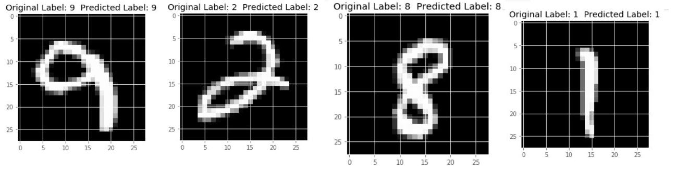

# What's My Digit?


## Description
This is Flask based web application where users can draw digits on the canvas provided in the website and that drawing is encoded as base64 string which is then converted to 28 * 28 grayscale image and is tested on the pre-trained models.
Model is trained using MNIST dataset and three classification algorithms K Nearest Neighbors, Support Vector Machines, Random Forest Clasifier were used.
For prediction of the user image, the image is tested on all the three classifiers and mode of those three predictions is returned as our prediction.
# Requirements

* Python 3.5 +
* Install all the required packages using

  ```
  pip install -r requirements.txt
  ```

# Usage

**1.** Download the four MNIST dataset files from this link:

```
http://yann.lecun.com/exdb/mnist/
```

**2.** Unzip and place the files in the dataset folder inside the MNIST_Dataset_Loader folder i.e :

```
model
|_ trainedModel
  |_ MNIST_Dataset_Loader
     |_ dataset
        |_ train-images-idx3-ubyte
        |_ train-labels-idx1-ubyte
        |_ t10k-images-idx3-ubyte
        |_ t10k-labels-idx1-ubyte
```
**3.** To train the models run the following commands :

```
cd model/trainedModel
python trainModel.py
(OR)
You can run through trainModel.ipynb if you use jupyter notebook
```
This will save the three models as pickle files for later use in prediction.

**4.** In the root folder run the following command to start the web application :

```
python app.py
```


# Results

## Accuracy on the test images provided in MNSIT dataset using Machine Learning Algorithms:

i)	 K Nearest Neighbors: 97.87%

ii)	 SVM:	96.88%

iii) Random Forest Classifier:	96.99%


## Test Images Classification Output:




## To be implemented:-
- Add requirements.txt
- Add introduction and details part for the web page.
- Add proper docs.
- Add loading screen when computing the result
- Make it responsive
