# What's My Digit?

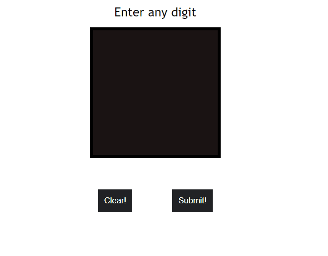

## Description
This is Flask based web application where users can draw digits on the canvas provided in the website and that drawing is encoded as base64 string which is then converted to 28 * 28 grayscale image and is tested on the pre-trained models.
Model is trained using MNIST dataset and three classification algorithms K Nearest Neighbors, Support Vector Machines, Random Forest Clasifier were used.
For prediction of the user image, the image is tested on all the three classifiers and mode of those three predictions is returned as our prediction.
# Requirements

* Python 3.5 +
* Install all the required packages using

  ```
  pip install -r requirements.txt
  ```

# Usage

**1.** Download the four MNIST dataset files from this link:

```
http://yann.lecun.com/exdb/mnist/
```

**2.** Unzip and place the files in the dataset folder inside the MNIST_Dataset_Loader folder i.e :

```
model
|_ trainedModel
  |_ MNIST_Dataset_Loader
     |_ dataset
        |_ train-images-idx3-ubyte
        |_ train-labels-idx1-ubyte
        |_ t10k-images-idx3-ubyte
        |_ t10k-labels-idx1-ubyte
```
**3.** To train the models run the following commands :

```
cd model/trainedModel
python trainModel.py
(OR)
You can run through trainModel.ipynb if you use jupyter notebook
```
This will save the three models as pickle files for later use in prediction.

**4.** In the root folder run the following command to start the web application :

```
python app.py
```


# Results

## Accuracy on the test images provided in MNSIT dataset using Machine Learning Algorithms:

i)	 K Nearest Neighbors: 97.87%

ii)	 SVM:	96.88%

iii) Random Forest Classifier:	96.99%


## Test Images Classification Output:

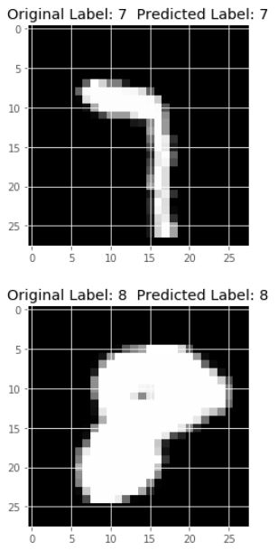 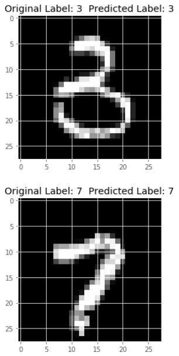 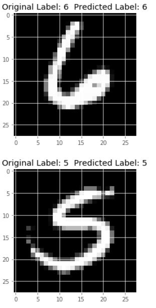 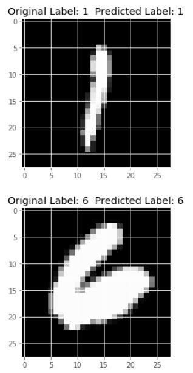

## User Drawn Images Classification Output:

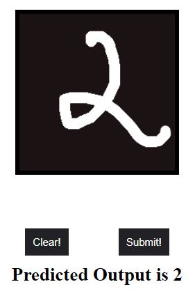 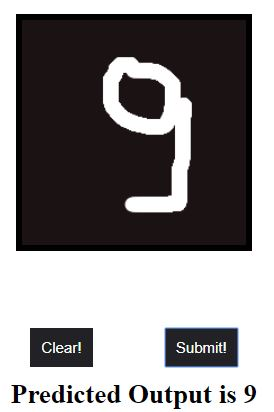 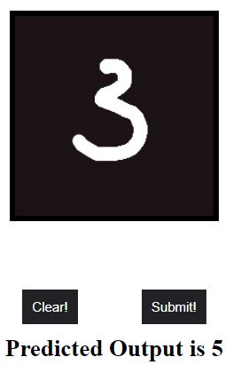 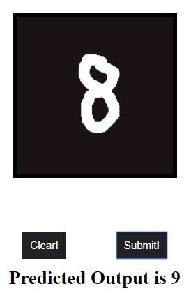 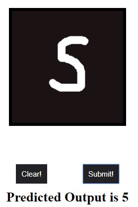 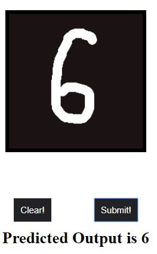

One of the reasons for wrong classification on user images :
```
The canvas provided is 200*200. So scaling the image down to MNIST compatible image (i.e. 28*28 grayscale image) results in loss
of some key features which are needed to correctly predict this image. So that's one of the reason for the wrong prediction of some images as we have seen in the above images.
```
## Technologies Used :-
- HTML + CSS + Javascript (for frontend)
- Flask (for backend)
- Python (for machine learning)

## To be implemented:-
- Add requirements.txt
- Add introduction and details part for the web page.
- Add loading screen when computing the result
- Make it responsive

## Issues:-
- Canvas is not getting displayed when its styling is put into style.css file

## Next Version:-
- To use Convolutional Neural Network which has better accuracy than these two

## Contributing Guidelines:-
1. Fork this repo.
2. Clone it on your local machine
3. Add new remote using `git remote add https://github.com/CSALS/Digit-Recognizer`
4. Create a new branch using `git checkout -b my-branch`
5. After making some changes commit them.
6. Rebase your commits with `upstream/master` using:
  - `git checkout master`
  - `git fetch upstream master`
  - `git reset --hard FETCH_HEAD`
  - `git checkout my-branch`
  - `git rebase master`
7. Resolve any merge conflicts and then push the branch with `git push origin my-branch`
8. Make a pull request with a description of your changes and wait for me to review it 😃 

All these steps ensure you make changes on top of my latest changes.

## Credits
- I followed this paper for implementing the algorithms [link](http://ijarcet.org/wp-content/uploads/IJARCET-VOL-6-ISSUE-7-990-997.pdf)
- For converting canvas image to MNIST compatible image [link](https://medium.com/@ashok.tankala/build-the-mnist-model-with-your-own-handwritten-digits-using-tensorflow-keras-and-python-f8ec9f871fd3)
- For MNIST Dataset Loader code [link](https://github.com/anujdutt9/Handwritten-Digit-Recognition-using-Deep-Learning/tree/master/MNIST_Dataset_Loader)
